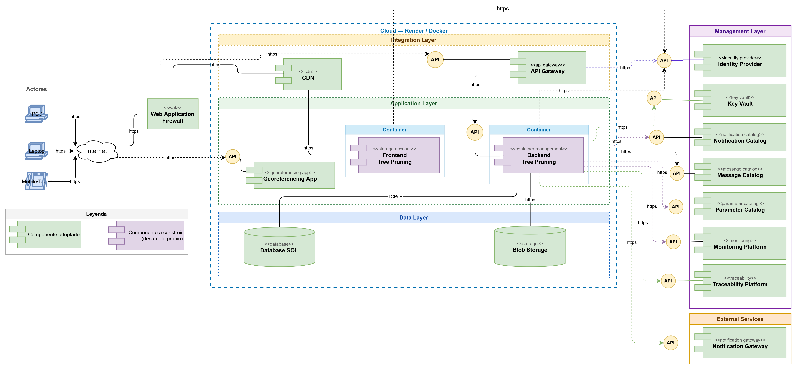
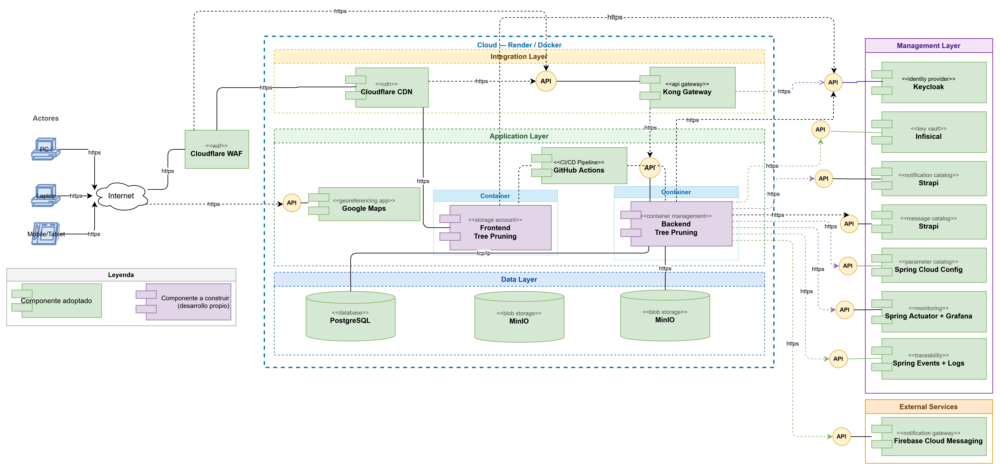
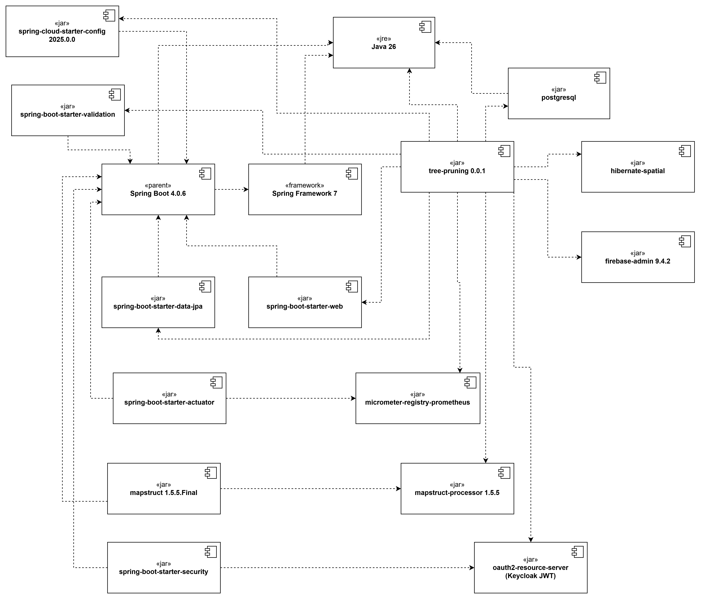
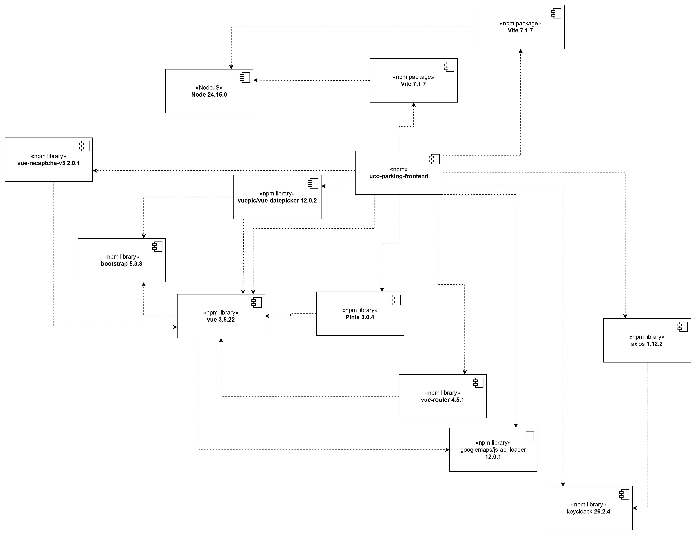
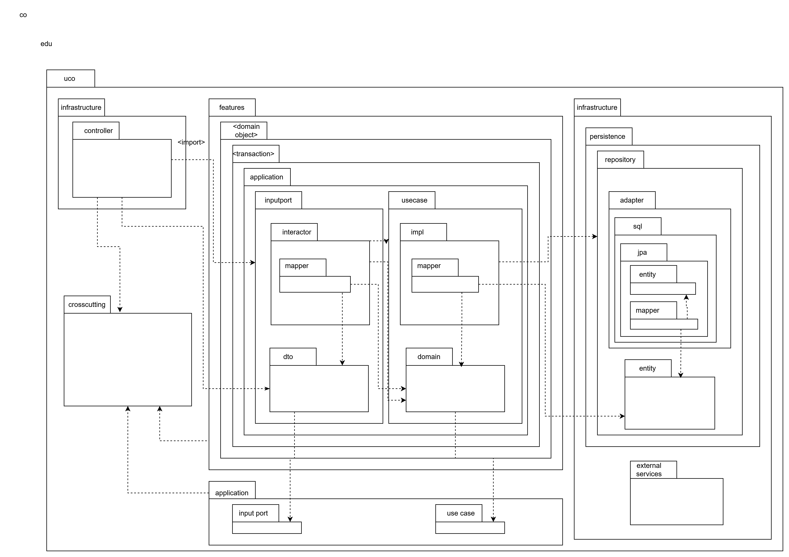
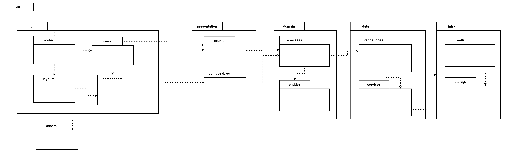

# Tree Pruning — Diseño de Alto Nivel

**Proyecto:** Tree Pruning — Sistema de Gestión de Arbolado Urbano  
**Universidad:** Universidad Católica de Oriente (UCO)  
**Curso:** Software 2  
**Municipio:** Rionegro, Antioquia, Colombia

> Este documento es la entrega del **diseño de alto nivel** correspondiente al semestre. Se compone de tres bloques principales: la **arquitectura de referencia** (arquetipo, arquitectura de referencia, documentación de elementos y plataforma tecnológica), los **drivers arquitectónicos** (atributos de calidad, funcionalidades críticas, restricciones de negocio y restricciones técnicas, con sus anexos) y el **mapa de impacto** (visión, actores, impactos y entregables). El detalle profundo (Incepción Ágil, modelo de dominio caracterizado, casos de uso completos, vistas lógica/procesos/física) se documenta en el DAS extendido y queda como complemento de este entregable.

---

## Tabla de Contenido

- [1. Arquitectura de Referencia](#sec-1)
  - [1.1 Arquetipo](#sec-1-1)
  - [1.2 Arquitectura de Referencia](#sec-1-2)
  - [1.3 Documentación de los Elementos](#sec-1-3)
  - [1.4 Plataforma Tecnológica](#sec-1-4)
  - [1.5 Diagrama de Componentes](#sec-1-5)
    - [1.5.1 Diagrama de Componentes — Backend](#sec-1-5-1)
    - [1.5.2 Diagrama de Componentes — Frontend](#sec-1-5-2)
  - [1.6 Diagrama de Paquetes](#sec-1-6)
    - [1.6.1 Diagrama de Paquetes — Backend](#sec-1-6-1)
    - [1.6.2 Diagrama de Paquetes — Frontend](#sec-1-6-2)
- [2. Drivers Arquitectónicos](#sec-2)
  - [2.1 Atributos de Calidad](#sec-2-1)
    - [2.1.1 Atributo: Rendimiento](#sec-2-1-1)
    - [2.1.2 Atributo: Confiabilidad](#sec-2-1-2)
    - [2.1.3 Atributo: Seguridad](#sec-2-1-3)
    - [2.1.4 Atributo: Disponibilidad](#sec-2-1-4)
    - [2.1.5 Atributo: Escalabilidad](#sec-2-1-5)
    - [2.1.6 Atributo: Trazabilidad](#sec-2-1-6)
    - [2.1.7 Atributo: Usabilidad](#sec-2-1-7)
  - [2.2 Funcionalidades Críticas](#sec-2-2)
  - [2.3 Restricciones de Negocio](#sec-2-3)
    - [2.3.1 Restricciones Humanas](#sec-2-3-1)
    - [2.3.2 Restricciones Legales/Normativas](#sec-2-3-2)
    - [2.3.3 Restricciones de Presupuesto/Costos](#sec-2-3-3)
    - [2.3.4 Restricciones de Tiempo](#sec-2-3-4)
    - [2.3.5 Restricciones de Alcance](#sec-2-3-5)
    - [2.3.6 Restricciones Operativas](#sec-2-3-6)
  - [2.4 Restricciones Técnicas](#sec-2-4)
  - [Anexo A — Matriz de Tiempos por Operación](#anexo-a)
  - [Anexo B — Matriz de Permisos por Rol](#anexo-b)
  - [Anexo C — Disponibilidad y SLA](#anexo-c)
- [3. Mapa de Impacto](#sec-3)
  - [3.1 Plantilla de Visión](#sec-3-1)
  - [3.2 Actores](#sec-3-2)
  - [3.3 Impactos por Actor](#sec-3-3)
  - [3.4 El Qué — Módulos y Entregables](#sec-3-4)

---

<a id="sec-1"></a>
## 1. Arquitectura de Referencia

La arquitectura de referencia describe la organización macroestructural de Tree Pruning, separada en dos niveles: primero el **arquetipo** (la forma genérica de la solución, agnóstica a tecnologías concretas) y luego la **arquitectura de referencia** propiamente dicha (la misma forma instanciada con las tecnologías seleccionadas). A continuación se documenta cada elemento de la arquitectura y se cierra con la plataforma tecnológica que materializa la solución.

---

<a id="sec-1-1"></a>
### 1.1 Arquetipo

El arquetipo describe la estructura general de la solución sin comprometerse aún con tecnologías concretas. Es el patrón conceptual aplicable a cualquier sistema web empresarial de gestión que combine información operativa con datos georreferenciados.

Tree Pruning adopta el arquetipo de **aplicación web empresarial de N-capas con gestión documental geoespacial**, organizado en cinco capas funcionales:

| Capa | Responsabilidad |
|---|---|
| **Capa de Presentación (SPA)** | Interfaz reactiva que se ejecuta en el navegador y se comunica con el backend exclusivamente mediante HTTPS/REST con tokens JWT. |
| **Capa de Integración (API Gateway)** | Punto de entrada único que centraliza enrutamiento, autenticación y políticas de acceso. |
| **Capa de Aplicación (Backend REST)** | Núcleo de lógica de negocio organizado en módulos funcionales independientes. |
| **Capa de Datos (SQL + Blob)** | Persistencia relacional con extensión geoespacial para el inventario y almacenamiento de objetos para evidencias fotográficas. |
| **Capa de Gestión (Management Layer)** | Servicios transversales de soporte: identidad, secretos, notificaciones, parámetros, monitoreo y trazabilidad. |

> **📷 Diagrama requerido — Arquetipo de Solución**  
> **Archivo:** `./images/tp-archetype.png`  
> **Descripción esperada:** Diagrama agnóstico que represente las cinco capas como bandas horizontales (Presentación, Integración, Aplicación, Datos, Gestión) con los componentes genéricos dentro de cada una (SPA, API Gateway, Servicios REST, Base de Datos, Blob Storage, Identity Provider, Key Vault, Notification Gateway, Monitoring Platform). Sin nombres de productos comerciales.



---

<a id="sec-1-2"></a>
### 1.2 Arquitectura de Referencia

La arquitectura de referencia instancia el arquetipo con los productos y tecnologías concretas seleccionadas para Tree Pruning. El sistema se despliega sobre una sola máquina virtual con todos los servicios corriendo como contenedores Docker orquestados por Docker Compose, expuestos al exterior a través de un reverse proxy (Traefik) protegido por un WAF y CDN perimetral (Cloudflare).

**Flujo de una solicitud externa:**

```
Usuario (Browser)
    ↓ HTTPS
Cloudflare (WAF + CDN)
    ↓ HTTPS
Traefik (reverse proxy, SSL termination)
    ↓ HTTP interno
┌──────────────────────────────────────────────┐
│  Azure VM — Docker Compose                   │
│                                              │
│  Frontend (nginx + Vue.js) ←→ API Gateway   │
│                                ↓             │
│                       Backend (Spring Boot)  │
│                          ↓               ↓   │
│                     PostgreSQL       MinIO   │
│                       + PostGIS      (S3)    │
│                                              │
│  Servicios de soporte:                       │
│  Keycloak, Strapi, Grafana, Prometheus,      │
│  SonarQube, Redis                            │
└──────────────────────────────────────────────┘
    ↓ HTTPS (servicios externos SaaS)
Infisical (secretos)  ·  Google Maps (mapas)
FCM (notificaciones)  ·  GitHub Actions (CI/CD)
```

> **📷 Diagrama requerido — Arquitectura de Referencia**  
> **Archivo:** `./images/tp-solution-architecture.png`  
> **Descripción esperada:** Mismo diagrama del arquetipo pero con los nombres de productos reales: Cloudflare en el WAF/CDN, Traefik como reverse proxy, Vue.js + Bootstrap en el frontend, Kong como API Gateway, Spring Boot 3.3+ con Java 26 en el backend, PostgreSQL 16 + PostGIS en la base de datos, MinIO en Blob Storage, Keycloak como Identity Provider, Infisical como Key Vault, FCM como Notification Gateway, Spring Cloud Config como Parameter Catalog, Prometheus + Grafana como Monitoring Platform.



---

<a id="sec-1-3"></a>
### 1.3 Documentación de los Elementos

Cada elemento de la arquitectura cumple una responsabilidad específica. Los elementos se clasifican en **Adoptados** (componentes externos integrados al sistema) y **Desarrollo Propio** (componentes construidos por el equipo).

| Elemento | Tipo | Descripción | Motivación / Justificación |
|---|---|---|---|
| **WAF** | Adoptado | Filtra el tráfico entrante y bloquea amenazas tipo SQLi, XSS y CSRF antes de llegar al backend. | Protege la información ciudadana y los datos institucionales del municipio sin costo. |
| **CDN** | Adoptado | Entrega el contenido estático del frontend con baja latencia desde el borde de red. | Optimiza el rendimiento de carga para usuarios en campo y oficina (RNF-01.01.01). |
| **Reverse Proxy** | Adoptado | Enruta el tráfico HTTPS hacia el contenedor correcto según el subdominio y termina el SSL. | Permite exponer múltiples servicios bajo un único dominio (`treepruning.org`) con certificados automáticos. |
| **API Gateway** | Adoptado | Punto de acceso unificado al backend. Gestiona enrutamiento, autenticación y políticas de seguridad. | Centraliza el acceso a todos los módulos y facilita el control de roles (ESC-CAL-SEG-0005). |
| **Identity Provider** | Adoptado | Gestiona la autenticación y autorización de los tres actores: Administrador, Encargado y Ciudadano. | Garantiza que cada usuario acceda únicamente a los módulos que le corresponden por rol (RBAC). |
| **Frontend Tree Pruning** | Desarrollo Propio | SPA accesible desde navegador, diseñada con enfoque mobile-first para uso en campo. | Permite el acceso a los tres actores desde cualquier dispositivo sin instalación. |
| **Backend Tree Pruning** | Desarrollo Propio | Núcleo de la lógica de negocio. Expone servicios REST para todos los módulos. | Centraliza las reglas de negocio y coordina la interacción entre módulos y datos. |
| **Database** | Adoptado | Persistencia de los datos del sistema: árboles, podas, PQR, usuarios y trazabilidad. | Garantiza consistencia, disponibilidad e integridad transaccional. |
| **Blob Storage** | Adoptado | Almacena las fotografías de evidencia adjuntas a cada poda ejecutada. | Evita sobrecargar la base de datos con archivos binarios y facilita la escalabilidad. |
| **Key Vault** | Adoptado | Almacenamiento seguro de credenciales, claves de API y secretos del sistema. | Evita la exposición de credenciales en el código fuente. |
| **Notification Gateway** | Adoptado | Envío de notificaciones push a navegadores (asignación de podas, cambios de estado de PQR, bloqueos de cuenta). | Cubre el requisito de alertas y el SLA de respuesta a PQR (Ley 1755). |
| **Monitoring Platform** | Adoptado | Plataforma de observabilidad y detección temprana de fallos del sistema. | Soporta el SLA de 99.5% de disponibilidad y el monitoreo periódico (ESC-CAL-DIS-0001). |
| **Parameter Catalog** | Adoptado | Externaliza los parámetros operativos del sistema (plazos legales de PQR, umbrales, configuraciones por municipio). | Permite ajustar reglas de negocio sin redespliegue del backend. |
| **Container Management** | Adoptado | Despliegue y ejecución de los contenedores del sistema sobre una sola máquina virtual. | Garantiza portabilidad y facilita la reproducibilidad del entorno. |
| **CMS Headless** | Adoptado | Gestión de contenidos editables del sistema (textos, plantillas de notificación, FAQ). | Permite al área de comunicaciones del municipio actualizar contenidos sin tocar código. |

---

<a id="sec-1-4"></a>
### 1.4 Plataforma Tecnológica

La plataforma tecnológica documenta el producto específico adoptado para cada elemento genérico de la arquitectura, junto con el fabricante, la versión, la modalidad de licenciamiento y la justificación de la elección. Todos los componentes operan bajo licencia open source o capa gratuita permanente para cumplir la restricción de presupuesto cero del proyecto académico.

| Elemento Genérico | Producto Adoptado | Fabricante | Versión | Open Source / Gratuito | Justificación de la elección |
|---|---|---|---|---|---|
| **WAF** | Cloudflare WAF | Cloudflare | Latest | Sí (capa gratuita) | Protección perimetral y mitigación DDoS sin costo. |
| **CDN** | Cloudflare CDN | Cloudflare | Latest | Sí (capa gratuita) | Distribución global de contenido estático sin costo. |
| **Reverse Proxy** | Traefik | Traefik Labs | v2.11 | Sí (open source) | SSL automático con Let's Encrypt vía Cloudflare DNS Challenge; descubrimiento automático de contenedores Docker. |
| **API Gateway** | Kong Gateway | Kong | 3.7 | Sí (open source) | Gateway robusto con soporte para autenticación, rate limiting y enrutamiento. |
| **Identity Provider** | Keycloak | Red Hat | 24.0 | Sí (open source) | OIDC y OAuth2 estándar; RBAC, SSO; gestión automática del contador de intentos fallidos. |
| **Frontend** | Vue.js 3 + Bootstrap 5.3+ | Vue.js / Bootstrap | 3.x / 5.3+ | Sí (open source) | Curva de aprendizaje suave; comunidad activa; componentes UI listos para producción. |
| **Backend — Lenguaje** | OpenJDK | Eclipse Adoptium | Java 26 | Sí (open source) | **Restricción del curso Software 2 (UCO).** |
| **Backend — Framework** | Spring Boot | VMware | 3.3+ | Sí (open source) | Arquitectura modular; soporte nativo para seguridad, eventos y persistencia. |
| **Backend — Persistencia** | Spring Data JPA + Hibernate | VMware / Red Hat | 3.x / 6.x | Sí (open source) | Reducción de complejidad y soporte transaccional integrado. |
| **Backend — Geoespacial** | PostGIS (extensión) | OSGeo | 3.x | Sí (open source) | Consultas espaciales nativas sobre coordenadas GPS y polígonos. |
| **Database** | PostgreSQL | PostgreSQL Global Dev Group | 16 | Sí (open source) | Base relacional confiable; soporte avanzado para datos geoespaciales mediante PostGIS. |
| **Blob Storage** | MinIO | MinIO Inc. | Latest | Sí (open source) | Compatible con S3 API; sin costo operativo. |
| **Key Vault** | Infisical | Infisical | Latest | Sí (capa gratuita) | SaaS sin mantenimiento de proceso `unseal`; secretos siempre disponibles vía CLI/API. |
| **Notification Gateway** | Firebase Cloud Messaging (FCM) | Google | Latest | Sí (capa gratuita) | Notificaciones push a navegador sin servidor SMTP propio. |
| **Monitoring Platform** | Prometheus + Grafana | Prometheus / Grafana Labs | Latest / 11.0.0 | Sí (open source) | Métricas en tiempo real y dashboards de disponibilidad. |
| **Parameter Catalog** | Spring Cloud Config | VMware | 4.x | Sí (open source) | Configuración centralizada y versionada en Git. |
| **CMS Headless** | Strapi | Strapi Solutions | Latest | Sí (open source) | API REST autogenerada y panel administrativo amigable. |
| **Caché** | Redis | Redis Ltd. | 7-alpine | Sí (open source) | Caché de puntos georreferenciados frecuentemente consultados. |
| **Container Management** | Docker + Docker Compose | Docker Inc. | Latest | Sí (open source) | Orquestación local sobre una VM con `restart: unless-stopped`. |
| **Hosting** | Azure Virtual Machine | Microsoft | Standard_B4ms | Sí (licencia académica) | 4 vCPU + 16 GB RAM gratuitos durante el semestre. |
| **DNS** | Cloudflare DNS | Cloudflare | Latest | Sí (capa gratuita) | DNS gestionado con soporte para *DNS Challenge* de Let's Encrypt. |
| **CI/CD** | GitHub Actions + GHCR | GitHub | Latest | Sí (capa gratuita) | **Restricción del curso Software 2 (UCO).** Pipelines de compilación, build de imagen y despliegue automático. |
| **Code Quality** | SonarQube | SonarSource | 10-community | Sí (open source) | Inspección continua de calidad y seguridad del código. |
| **Mapas** | Google Maps Platform | Google | Latest | Sí (capa gratuita) | Visualización geográfica del inventario con créditos mensuales gratuitos suficientes. |
| **IDE Backend** | Eclipse IDE + Spring Tools 4 | Eclipse Foundation | 2024-12 | Sí (open source) | Soporte completo y gratuito para Spring Boot. |
| **IDE Frontend** | Visual Studio Code | Microsoft | Latest | Sí (gratuito) | Editor ligero y extensible estándar para proyectos Vue.js. |

---

---

<a id="sec-1-5"></a>
### 1.5 Diagrama de Componentes

El diagrama de componentes muestra las unidades de software (jars, librerías, paquetes npm) que conforman cada parte del sistema y las dependencias entre ellas. A diferencia del diagrama de despliegue (que muestra los contenedores en ejecución) y del diagrama de paquetes (que muestra la organización del código fuente), el diagrama de componentes detalla las **librerías técnicas concretas** que el equipo integra para construir el Backend y el Frontend.

<a id="sec-1-5-1"></a>
#### 1.5.1 Diagrama de Componentes — Backend

El Backend de Tree Pruning se construye como un único módulo `tree-pruning 0.0.1` que orquesta todas las dependencias técnicas. El proyecto se compila con Maven sobre Java 26 y empaqueta todas las dependencias en una imagen Docker basada en `eclipse-temurin:26-jdk-alpine`.

| Componente | Tipo | Versión | Responsabilidad |
|---|---|---|---|
| **tree-pruning 0.0.1** | jar (módulo principal) | 0.0.1 | Aplicación Spring Boot del sistema. Depende de todas las librerías listadas abajo. |
| **Java** | jre | 26 | Runtime del Backend. Restricción técnica del curso (RT-001). |
| **Spring Boot** | parent | 4.0.6 | Framework base que provee autoconfiguración y starter dependencies. |
| **Spring Framework** | framework | 7 | Núcleo de Spring (IoC, DI, AOP) sobre el cual se construye Spring Boot. |
| **spring-boot-starter-web** | jar | (gestionado por parent) | Exposición de APIs REST con Spring MVC y Tomcat embebido. |
| **spring-boot-starter-data-jpa** | jar | (gestionado por parent) | Persistencia con Spring Data JPA + Hibernate. |
| **spring-boot-starter-validation** | jar | (gestionado por parent) | Validación de DTOs con Bean Validation (anotaciones `@NotNull`, `@Size`, etc.). |
| **spring-boot-starter-security** | jar | (gestionado por parent) | Spring Security: cadena de filtros, configuración de seguridad. |
| **spring-boot-starter-oauth2-resource-server** | jar | (gestionado por parent) | Validación de JWT emitidos por Keycloak. |
| **spring-boot-starter-actuator** | jar | (gestionado por parent) | Endpoints de monitoreo (`/actuator/health`, `/actuator/prometheus`). |
| **spring-cloud-starter-config** | jar | 2025.0.0 | Cliente de Spring Cloud Config. Obtiene parámetros operativos del Config Server al arranque. |
| **micrometer-registry-prometheus** | jar | (gestionado por parent) | Exposición de métricas en formato Prometheus para integrar con Grafana. |
| **mapstruct** | jar | 1.5.5.Final | Generación automática de mappers entre DTO, Domain y JPA Entity. |
| **mapstruct-processor** | jar | 1.5.5 | Procesador de anotaciones de MapStruct usado en tiempo de compilación. |
| **postgresql** | jar | (gestionado por parent) | Driver JDBC de PostgreSQL. |
| **hibernate-spatial** | jar | (gestionado por parent) | Extensión de Hibernate para tipos geoespaciales (Point, Polygon) compatibles con PostGIS. |
| **firebase-admin** | jar | 9.4.2 | SDK de Firebase para enviar notificaciones push (FCM) al Frontend. |

> **Diagrama requerido — Diagrama de Componentes Backend**  
> **Archivo:** `./images/tp-component-backend.png`  
> **Descripción esperada:** Diagrama UML de componentes donde el componente central `tree-pruning 0.0.1` depende de todos los jars y starters listados. El parent `Spring Boot 4.0.6` provee transitivamente Spring Framework 7 y la mayoría de los starters. Java 26 aparece como ambiente de ejecución (`<<jre>>`).



<a id="sec-1-5-2"></a>
#### 1.5.2 Diagrama de Componentes — Frontend

El Frontend es una SPA (Single Page Application) Vue.js 3 empaquetada con Vite. Todas las dependencias se gestionan vía npm y se compilan en un bundle estático servido por nginx desde el contenedor Docker.

| Componente | Tipo | Versión | Responsabilidad |
|---|---|---|---|
| **tree-pruning-frontend** | npm (paquete principal) | 0.0.1 | SPA contenedora que orquesta vistas, store, router, servicios HTTP y SDKs externos. |
| **Node** | NodeJS (entorno de build) | 24.15.0 | Runtime utilizado únicamente durante el proceso de compilación (`npm run build`). |
| **Vite** | npm package | 7.1.7 | Bundler y servidor de desarrollo. Genera el bundle estático que se sirve en producción. |
| **vue** | npm library | 3.5.22 | Framework reactivo base. Composition API y Single-File Components. |
| **vue-router** | npm library | 4.5.1 | Router declarativo con guards `beforeEach` para control de acceso por rol. |
| **Pinia** | npm library | 3.0.4 | Store de estado global: token JWT, rol del usuario, módulos habilitados. |
| **axios** | npm library | 1.12.2 | Cliente HTTP con interceptores (request: adjunta JWT; response: gestiona 401/403). |
| **bootstrap** | npm library | 5.3.8 | Biblioteca de componentes UI: grid, formularios, tablas, modales, alertas. |
| **vuepic/vue-datepicker** | npm library | 12.0.2 | Componente de selección de fechas para formularios (Podas, PQR, Reportes). |
| **googlemaps/js-api-loader** | npm library | 12.0.1 | Carga del SDK de Google Maps Platform de forma controlada y diferida. |
| **vue-recaptcha-v3** | npm library | 2.0.1 | Integración de Google reCAPTCHA v3 para protección contra bots en formularios públicos (PQR). |
| **keycloak** | npm library | 26.2.4 | SDK de Keycloak: login, refresh de token JWT, logout y validación de roles del lado cliente. |

> **Diagrama requerido — Diagrama de Componentes Frontend**  
> **Archivo:** `./images/tp-component-frontend.png`  
> **Descripción esperada:** Diagrama UML de componentes donde `tree-pruning-frontend` depende de las librerías npm listadas. Vite es la herramienta de build y consume Node.js como entorno de ejecución del build. Bootstrap y vue-datepicker dependen de vue como peer dependency. Pinia y vue-router también dependen de vue. Axios y keycloak son librerías independientes que se conectan a servicios externos (API Gateway y Keycloak respectivamente).



---

<a id="sec-1-6"></a>
### 1.6 Diagrama de Paquetes

El diagrama de paquetes representa la organización lógica del código fuente en agrupaciones jerárquicas que reflejan la separación de responsabilidades del sistema. Tanto el Backend como el Frontend adoptan los principios de **Clean Architecture**, donde las capas externas dependen de las internas y nunca al revés.

<a id="sec-1-6-1"></a>
#### 1.6.1 Diagrama de Paquetes — Backend

El Backend combina **Clean Architecture** (capas con flujo de dependencias unidireccional) con **Vertical Slice Architecture** (cada caso de uso es un slice vertical completo dentro de `features/<domain-object>/<transaction>/`). Esta organización garantiza cohesión por caso de uso, aislamiento de cambios y reutilización controlada.

**Estructura general (placeholders):**

```
co.edu.uco.treepruning
│
├── initializer                        (clase main de Spring Boot)
│
├── crosscutting                       (preocupaciones transversales:
│                                       exception, helper, response)
│
├── application                        (contratos base globales:
│                                       inputport, usecase)
│
├── features                           (slices verticales por caso de uso)
│   └── <domain-object>
│       └── <transaction>
│           └── application
│               ├── inputport          (contrato de entrada: dto,
│               │                       validator, interactor, mapper)
│               └── usecase            (operación de negocio: domain,
│                                       impl, mapper, rules)
│
└── infrastructure                     (adaptadores)
    ├── controller                    (adaptadores de entrada — REST)
    ├── security                      (Spring Security + JWT)
    └── persistence
        └── repository                (puertos de salida)
            ├── adapter/sql/jpa       (implementación JPA)
            └── sql/jpa               (Spring Data JPA + entidades)
```

**Responsabilidad de cada paquete:**

| Paquete | Contiene |
|---|---|
| `initializer` | Clase main `@SpringBootApplication`. Punto de entrada del Backend. |
| `crosscutting` | Excepciones genéricas, helpers (fechas, números, texto), respuesta HTTP estándar y manejador centralizado de excepciones. |
| `application` | Interfaces base `InputPort` y `UseCase` que definen el contrato común para cualquier caso de uso. |
| `features.<domain-object>.<transaction>.inputport` | Cómo se invoca el caso de uso desde afuera: DTO, validador, interactor y mapper. |
| `features.<domain-object>.<transaction>.usecase` | La operación de negocio: contrato, dominio, implementación, mapper y excepciones de negocio (paquete `rules`). |
| `infrastructure.controller` | Controladores REST con sus objetos de request. |
| `infrastructure.security` | Configuración de Spring Security y validación de JWT. |
| `infrastructure.persistence.repository` | Puertos de salida (interfaces) y adapters JPA con mappers MapStruct. |

> **Diagrama requerido — Diagrama de Paquetes Backend**  
> **Archivo:** `./images/tp-package-backend.png`  
> **Descripción esperada:** Diagrama UML de paquetes que represente la estructura `co.edu.uco.treepruning` con sus paquetes principales (`initializer`, `crosscutting`, `application`, `features`, `infrastructure`) usando placeholders genéricos `<domain-object>` y `<transaction>` para mostrar el patrón aplicable a cualquier feature. Las flechas de dependencia deben respetar la regla de Clean Architecture: `infrastructure` depende de `features`, `features` depende de `application`, todos pueden depender de `crosscutting`.



<a id="sec-1-6-2"></a>
#### 1.6.2 Diagrama de Paquetes — Frontend

El Frontend también adopta **Clean Architecture**, separando las preocupaciones en cinco capas: presentación de UI, gestión de estado, lógica de dominio, acceso a datos e infraestructura. Esta separación permite cambiar la librería UI o el cliente HTTP sin afectar la lógica de negocio del aplicativo.

**Estructura general:**

```
src
│
├── ui                                 (capa de presentación visual)
│   ├── router                        (rutas de Vue Router + guards)
│   ├── views                         (páginas que renderiza el router)
│   ├── layouts                       (layouts compartidos entre vistas)
│   ├── components                    (componentes Bootstrap reutilizables)
│   └── assets                        (imágenes, íconos, estilos globales)
│
├── presentation                       (capa de estado e interacción)
│   ├── stores                        (Pinia: JWT, rol, módulos habilitados)
│   └── composables                   (lógica reactiva reutilizable:
│                                      validaciones, formateo, mapa)
│
├── domain                             (capa de negocio pura)
│   ├── usecases                      (casos de uso del aplicativo)
│   └── entities                      (entidades de dominio)
│
├── data                               (capa de acceso a datos)
│   ├── repositories                  (implementación de repositorios)
│   └── services                      (servicios Axios al API Gateway)
│
└── infra                              (capa de infraestructura técnica)
    ├── auth                          (integración con Keycloak: login,
    │                                  refresh, logout)
    └── storage                       (almacenamiento local de sesión)
```

**Responsabilidad de cada paquete:**

| Paquete | Contiene |
|---|---|
| `ui.router` | Definición de rutas de Vue Router 4 con `beforeEach` guards que verifican rol y JWT antes de renderizar cada vista. |
| `ui.views` | Páginas principales del aplicativo (una vista por ruta). |
| `ui.layouts` | Layouts compartidos: layout principal con barra lateral, layout público para PQR ciudadanas, layout de login. |
| `ui.components` | Componentes Bootstrap reutilizables: tablas con paginación, formularios validados, modales, alertas. |
| `ui.assets` | Recursos estáticos: íconos, imágenes, estilos globales. |
| `presentation.stores` | Stores de Pinia que mantienen el estado global: token JWT, datos del usuario autenticado, rol, módulos habilitados. |
| `presentation.composables` | Lógica reactiva reutilizable (Vue Composition API): validación de formularios, formateo de fechas, manejo del mapa interactivo. |
| `domain.usecases` | Casos de uso del negocio orquestados desde el Frontend (por ejemplo, "Crear PQR" coordina servicios de upload de fotos + envío de formulario + redirección). |
| `domain.entities` | Entidades de dominio del Frontend (Árbol, Poda, PQR) sin acoplamiento a la implementación HTTP. |
| `data.repositories` | Implementación del patrón Repository: abstrae el acceso a los datos del Backend. |
| `data.services` | Servicios Axios que hacen las llamadas HTTP concretas al API Gateway. |
| `infra.auth` | Integración con Keycloak: login redirect, refresh automático de JWT, logout, validación de roles del lado cliente. |
| `infra.storage` | Wrapper de sessionStorage / localStorage para persistir información temporal (preferencias del usuario, último filtro aplicado). |

> **Diagrama requerido — Diagrama de Paquetes Frontend**  
> **Archivo:** `./images/tp-package-frontend.png`  
> **Descripción esperada:** Diagrama UML de paquetes con el contenedor raíz `SRC` y las cinco capas (`ui`, `presentation`, `domain`, `data`, `infra`) más el paquete de `assets`. Las flechas de dependencia deben mostrar el flujo de Clean Architecture: `ui` → `presentation` → `domain` ← `data` → `infra`. La capa de `domain` es el núcleo y no debe depender de ninguna otra.



---

<a id="sec-2"></a>
## 2. Drivers Arquitectónicos

Los drivers arquitectónicos son el conjunto de motivadores que condicionan las decisiones de diseño del sistema: los atributos de calidad priorizados, las funcionalidades críticas del negocio, las restricciones de negocio impuestas por el contexto y las restricciones técnicas heredadas del entorno académico. Cada driver se mapea a las decisiones de la arquitectura de referencia (sección 1) y los anexos detallan las matrices operativas que soportan los escenarios de calidad.

---

<a id="sec-2-1"></a>
### 2.1 Atributos de Calidad

Los atributos de calidad son las propiedades del sistema que determinan su grado de excelencia más allá de la funcionalidad básica. Para Tree Pruning se identificaron 16 atributos mediante votación ponderada por los tres actores del sistema (Administrador, Encargado de Cuadrilla, Ciudadano), resultando en la siguiente priorización:

| Prioridad | Atributo de Calidad | Puntaje |
|---|---|---|
| 1 | Usabilidad | 16 |
| 2 | Seguridad | 15 |
| 3 | Disponibilidad | 14 |
| 4 | Confiabilidad | 13 |
| 5 | Rendimiento | 12 |
| 6 | Accesibilidad | 11 |
| 7 | Escalabilidad | 10 |
| 8 | Costo | 9 |
| 9 | Trazabilidad | 8 |
| 10 | Interoperabilidad | 7 |
| 11 | Capacidad | 6 |
| 12 | Capacidad para ser desplegado | 5 |
| 13 | Capacidad para ser soportado | 4 |
| 14 | Capacidad para ser administrado | 3 |
| 15 | Capacidad para ser mantenido | 2 |
| 16 | Conformidad | 1 |

<a id="sec-2-1-1"></a>
#### 2.1.1 Atributo: Rendimiento

El rendimiento garantiza que el sistema responde a las solicitudes de los usuarios dentro de los tiempos máximos establecidos, incluso bajo carga concurrente, manteniendo la experiencia de uso fluida para los tres actores.

<a id="sec-2-1-1-1"></a>
##### 2.1.1.1 Característica CAR-REN-0001 — Tiempos máximos por operación

El sistema debe asegurar que cada una de las operaciones en las cuales se especifique un tiempo máximo de respuesta, cumpla dicho tiempo de respuesta de manera obligatoria.

**Escenario ESC-CAL-REN-0002 — Registro exitoso de información dentro del tiempo máximo**

| Campo | Detalle |
|---|---|
| **Código** | ESC-CAL-REN-0002 |
| **Nombre** | Registro exitoso de información en el sistema dentro del tiempo máximo permitido |
| **Objetivo** | Asegurar que el sistema procese y confirme el guardado de registros (árbol, sector, PQR, poda o herramienta) en un tiempo menor o igual al definido |
| **Criterio de éxito** | Luego de que el usuario ejecuta la acción guardar, el sistema muestra el mensaje de éxito de guardado en un tiempo menor o igual al definido en la Matriz de Tiempos |
| **Prerequisitos** | El usuario debe estar autenticado en el sistema con permisos de registro |
| **Fuente del estímulo** | Usuario autenticado con permisos de registro (administrador, operario o ciudadano según el módulo) |
| **Estímulo** | Diligenciar el formulario de registro y ejecutar la acción guardar |
| **Ambiente** | Operación normal en ambiente productivo |
| **Artefacto** | Sistema |
| **Respuesta** | El sistema procesa la solicitud, persiste el registro en la base de datos y muestra el mensaje de éxito |
| **Medida de la respuesta** | El mensaje de éxito es visible en un tiempo ≤ al definido en la Matriz de Tiempos |

**Escenario ESC-CAL-REN-0003 — Carga del mapa dentro del tiempo máximo**

| Campo | Detalle |
|---|---|
| **Código** | ESC-CAL-REN-0003 |
| **Nombre** | Carga de la utilidad de visualización de árboles o podas en el mapa dentro del tiempo máximo |
| **Objetivo** | Asegurar que el sistema cargue completamente la utilidad de visualización en el mapa en un tiempo ≤ al definido |
| **Criterio de éxito** | El mapa con los árboles o podas georreferenciados es visible e interactuable en el tiempo máximo |
| **Prerequisitos** | El usuario debe estar autenticado con permisos de visualización |
| **Fuente del estímulo** | Usuario autenticado (encargado de cuadrilla) |
| **Estímulo** | Acceder a la utilidad de visualización de árboles o podas en el mapa |
| **Ambiente** | Operación normal en ambiente productivo |
| **Artefacto** | Sistema |
| **Respuesta** | El sistema carga y renderiza el mapa con los árboles o podas georreferenciados |
| **Medida de la respuesta** | El mapa es completamente visible e interactuable en un tiempo ≤ al definido en la Matriz de Tiempos |

<a id="sec-2-1-2"></a>
#### 2.1.2 Atributo: Confiabilidad

La confiabilidad garantiza que el sistema mantiene la integridad de la información durante su funcionamiento, asegurando que las operaciones se completen de forma consistente y que los fallos no dejen datos en estados inconsistentes.

<a id="sec-2-1-2-1"></a>
##### 2.1.2.1 Característica CAR-CON-0001 — Integridad de la información

**Escenario ESC-CAL-CON-0001 — Validación y actualización al crear o modificar registros**

| Campo | Detalle |
|---|---|
| **Código** | ESC-CAL-CON-0001 |
| **Nombre** | Validación y actualización de información al crear o modificar registros en el sistema |
| **Objetivo** | Asegurar que el sistema valide correctamente la información ingresada según las reglas de negocio y actualice el listado de registros con los valores exactos ingresados |
| **Criterio de éxito** | El sistema valida la información antes de ejecutar la acción de guardado y el listado muestra el registro con los valores exactos |
| **Prerequisitos** | El usuario debe estar autenticado con permisos de creación o modificación |
| **Fuente del estímulo** | Usuario autenticado con permisos de creación o modificación (administrador) |
| **Estímulo** | Crear o modificar un registro en el sistema y ejecutar la acción de guardado |
| **Ambiente** | Operación normal en ambiente productivo |
| **Artefacto** | Sistema |
| **Respuesta** | El sistema valida la información ingresada, guarda el registro y muestra la lista actualizada |
| **Medida de la respuesta** | La lista actualizada muestra el registro con los valores exactos ingresados por el usuario |

<a id="sec-2-1-2-2"></a>
##### 2.1.2.2 Característica CAR-CON-0002 — Atomicidad de operaciones

**Escenario ESC-CAL-CON-0003 — Reversión automática ante pérdida de conexión**

| Campo | Detalle |
|---|---|
| **Código** | ESC-CAL-CON-0003 |
| **Nombre** | Reversión automática de cambios ante pérdida de conexión durante la creación de podas preventivas anuales |
| **Objetivo** | Asegurar que la creación del conjunto de podas preventivas anuales se trate como una unidad atómica; si ocurre un fallo, el sistema revierte todos los cambios parciales |
| **Criterio de éxito** | Ante una pérdida de conexión, el sistema revierte la transacción y la base de datos no contiene ningún registro parcial |
| **Prerequisitos** | El usuario debe estar autenticado con permisos para crear podas preventivas |
| **Fuente del estímulo** | Usuario autenticado (encargado de cuadrilla) + fallo externo (pérdida de conexión) |
| **Estímulo** | Pérdida de conexión, error del sistema o interrupción inesperada durante la creación del conjunto de podas preventivas |
| **Ambiente** | Operación normal en ambiente productivo |
| **Artefacto** | Sistema |
| **Respuesta** | El sistema detecta la interrupción, revierte la transacción y notifica al usuario |
| **Medida de la respuesta** | La base de datos no contiene ningún registro parcial de las podas preventivas que se intentaron crear |

<a id="sec-2-1-3"></a>
#### 2.1.3 Atributo: Seguridad

La seguridad protege el acceso no autorizado al sistema mediante métodos de autenticación robustos, control de sesiones y presentación de información según los permisos asignados a cada rol.

<a id="sec-2-1-3-1"></a>
##### 2.1.3.1 Característica CAR-SEG-0001 — Autenticación y control de acceso

**Escenario ESC-CAL-SEG-0002 — Bloqueo temporal por 3 intentos fallidos**

| Campo | Detalle |
|---|---|
| **Código** | ESC-CAL-SEG-0002 |
| **Nombre** | Bloqueo temporal de cuenta por intentos fallidos de autenticación consecutivos |
| **Objetivo** | Asegurar que el sistema bloquee temporalmente una cuenta durante 5 minutos cuando se detectan 3 intentos fallidos consecutivos |
| **Criterio de éxito** | Luego del tercer intento fallido consecutivo, el sistema bloquea la cuenta e informa al usuario |
| **Prerequisitos** | El usuario debe existir en el sistema |
| **Fuente del estímulo** | Usuario o actor no autorizado intentando acceder al sistema |
| **Estímulo** | Introducir contraseña incorrecta en 3 intentos consecutivos para una cuenta existente |
| **Ambiente** | Operación normal en ambiente productivo |
| **Artefacto** | Sistema |
| **Respuesta** | El sistema detecta el tercer intento fallido, bloquea temporalmente la cuenta e informa al usuario |
| **Medida de la respuesta** | La cuenta permanece bloqueada 5 minutos rechazando cualquier intento de acceso durante ese período |

<a id="sec-2-1-3-2"></a>
##### 2.1.3.2 Característica CAR-SEG-0002 — Módulos según rol

**Escenario ESC-CAL-SEG-0005 — Visualización de módulos según el rol autenticado**

| Campo | Detalle |
|---|---|
| **Código** | ESC-CAL-SEG-0005 |
| **Nombre** | Visualización de módulos en el menú principal según el rol del usuario autenticado |
| **Objetivo** | Asegurar que el sistema muestre en la barra lateral únicamente los módulos a los cuales tiene acceso el rol del usuario |
| **Criterio de éxito** | La barra lateral muestra exclusivamente los módulos correspondientes al rol activo, sin que aparezca ningún módulo no autorizado |
| **Prerequisitos** | El usuario debe estar autenticado con un rol válido y activo |
| **Fuente del estímulo** | Usuario autenticado con rol y permisos previamente asignados |
| **Estímulo** | Ingresar al sistema y acceder a la vista principal con la barra lateral |
| **Ambiente** | Operación normal en ambiente productivo |
| **Artefacto** | Sistema |
| **Respuesta** | El sistema evalúa el rol y renderiza la barra lateral mostrando únicamente los módulos autorizados |
| **Medida de la respuesta** | La barra lateral muestra exactamente los módulos asignados al rol, sin que aparezca ningún módulo no autorizado |

<a id="sec-2-1-4"></a>
#### 2.1.4 Atributo: Disponibilidad

La disponibilidad garantiza que el sistema esté operativo y accesible durante el horario laboral establecido, con mecanismos de recuperación ante fallos y copias de seguridad diarias.

<a id="sec-2-1-4-1"></a>
##### 2.1.4.1 Característica CAR-DIS-0001 — Disponibilidad en horario laboral

**Escenario ESC-CAL-DIS-0001 — Disponibilidad y respuesta en horario establecido**

| Campo | Detalle |
|---|---|
| **Código** | ESC-CAL-DIS-0001 |
| **Nombre** | Disponibilidad y respuesta del sistema durante el horario establecido |
| **Objetivo** | Asegurar que el sistema esté disponible y responda correctamente durante el horario laboral (6 AM – 6 PM) con disponibilidad del 99.5% anual |
| **Criterio de éxito** | El sistema está disponible para todos los usuarios, garantizando 99.5% de disponibilidad anual durante el horario laboral |
| **Prerequisitos** | El usuario debe existir en el sistema con cuenta activa y vigente |
| **Fuente del estímulo** | Usuario autenticado o por autenticar que intenta acceder dentro del horario laboral |
| **Estímulo** | Intentar ingresar al aplicativo y realizar solicitudes |
| **Ambiente** | Operación normal en ambiente productivo |
| **Artefacto** | Sistema |
| **Respuesta** | El sistema se encuentra disponible, permite el ingreso y responde correctamente a todas las solicitudes |
| **Medida de la respuesta** | El sistema mantiene disponibilidad continua durante el 99.5% de las horas anuales del horario laboral |

<a id="sec-2-1-5"></a>
#### 2.1.5 Atributo: Escalabilidad

**Escenario ESC-CAL-ESC-0028 — Continuidad operativa ante desactivación de funcionalidad**

| Campo | Detalle |
|---|---|
| **Código** | ESC-CAL-ESC-0028 |
| **Nombre** | Continuidad operativa del sistema base ante la desactivación de una funcionalidad nueva |
| **Objetivo** | Asegurar que la desactivación de una funcionalidad nueva por fallo o mantenimiento no afecte el funcionamiento de los módulos base |
| **Criterio de éxito** | Los módulos base (inventario, podas, reportes, PQR) responden correctamente según la Matriz de Tiempos luego de desactivar una funcionalidad nueva |
| **Prerequisitos** | El sistema debe tener al menos una funcionalidad nueva integrada y activa |
| **Fuente del estímulo** | Administrador del sistema |
| **Estímulo** | Desactivación de una funcionalidad nueva (alerta automática o módulo de análisis) por fallo o mantenimiento |
| **Ambiente** | Operación normal en ambiente productivo |
| **Artefacto** | Sistema |
| **Respuesta** | El sistema aísla el módulo desactivado sin propagar el fallo hacia los módulos base |
| **Medida de la respuesta** | Los módulos base responden correctamente según la Matriz de Tiempos, sin errores visibles para el usuario |

<a id="sec-2-1-6"></a>
#### 2.1.6 Atributo: Trazabilidad

**Escenario ESC-CAL-TRA-0036 — Bloqueo y notificación ante 5 intentos fallidos**

| Campo | Detalle |
|---|---|
| **Código** | ESC-CAL-TRA-0036 |
| **Nombre** | Bloqueo automático de cuenta y notificación al administrador ante intentos fallidos consecutivos |
| **Objetivo** | Asegurar que el sistema registre todos los intentos fallidos y bloquee automáticamente la cuenta tras 5 intentos en menos de 10 minutos |
| **Criterio de éxito** | La cuenta queda bloqueada automáticamente y se envía notificación al administrador |
| **Prerequisitos** | El usuario debe existir en el sistema con cuenta activa y vigente |
| **Fuente del estímulo** | Usuario o actor no autorizado que intenta acceder repetidamente con credenciales incorrectas |
| **Estímulo** | Producir 5 intentos fallidos consecutivos para un mismo usuario en menos de 10 minutos |
| **Ambiente** | Operación normal en ambiente productivo |
| **Artefacto** | Sistema |
| **Respuesta** | El sistema registra cada intento, bloquea la cuenta en el quinto intento y notifica al administrador |
| **Medida de la respuesta** | La cuenta queda bloqueada tras el quinto intento; el administrador recibe notificación en menos de 1 minuto |

<a id="sec-2-1-7"></a>
#### 2.1.7 Atributo: Usabilidad

**Escenario ESC-CAL-USA-0003 — Interacción y estilo uniforme en formularios**

| Campo | Detalle |
|---|---|
| **Código** | ESC-CAL-USA-0003 |
| **Nombre** | Interacción y estilo uniforme en los formularios |
| **Objetivo** | Garantizar que todos los formularios presenten estructura, estilo visual y comportamiento consistentes |
| **Criterio de éxito** | Al interactuar con un formulario, el usuario identifica inmediatamente el campo activo mediante indicador visual, los campos obligatorios con asterisco (*) y los mensajes de error en rojo debajo del campo |
| **Prerequisitos** | Usuario autenticado con sesión activa en el sistema |
| **Fuente del estímulo** | Cualquier usuario del sistema |
| **Estímulo** | El usuario selecciona o interactúa con un formulario para ingresar datos |
| **Ambiente** | Operación normal en ambiente productivo o pruebas |
| **Artefacto** | Sistema |
| **Respuesta** | El sistema presenta el formulario con campos obligatorios identificados mediante asterisco (*), delimitadores de color verde y mensajes de error descriptivos |
| **Medida de la respuesta** | El 100% de los campos obligatorios son identificados visualmente por el usuario mediante asterisco (*) y delimitador de color verde |


<a id="sec-2-2"></a>
### 2.2 Funcionalidades Críticas

Las funcionalidades críticas son aquellas sin las cuales el sistema no cumple su propósito fundamental. Su identificación permite priorizar el esfuerzo de desarrollo y validar que la arquitectura las soporte adecuadamente.

| Código | Funcionalidad | Módulo | Actores |
|---|---|---|---|
| **FC-001** | Registro y gestión del inventario de árboles georreferenciados | Inventario | Administrador |
| **FC-002** | Planificación y programación de podas preventivas y correctivas | Podas | Encargado de Cuadrilla |
| **FC-003** | Ejecución y evidencia fotográfica de podas en campo | Podas | Encargado de Cuadrilla |
| **FC-004** | Registro y seguimiento de PQR ciudadanas sobre el arbolado | PQR | Ciudadano |
| **FC-005** | Generación y exportación de reportes institucionales | Reportes | Administrador |
| **FC-006** | Autenticación y control de acceso por roles (RBAC) | Transversal | Todos |
| **FC-007** | Visualización geográfica del inventario y podas en mapa interactivo | Inventario / Podas | Administrador, Encargado |
| **FC-008** | Trazabilidad completa de acciones de usuarios | Transversal | Todos |

---

<a id="sec-2-3"></a>
### 2.3 Restricciones de Negocio

Las restricciones de negocio son condicionantes impuestos por el contexto organizacional, legal, económico, humano o temporal del proyecto que delimitan el espacio de soluciones viables y que el equipo debe asumir como hechos no negociables al momento de diseñar. A diferencia de las restricciones técnicas (sección 3.1), estas no provienen del entorno tecnológico sino del contexto del cliente y del modo en que el proyecto se ejecuta.

Para Tree Pruning se identificaron veinte restricciones agrupadas en seis categorías. Las primeras cinco categorías (Humano, Legal/Normativo, Presupuesto/Costos, Tiempo y Alcance) corresponden a riesgos del proyecto y para cada una se documenta su importancia, los riesgos asociados y el plan de acción que el equipo adopta para mitigarlos. La sexta categoría (Operativas) corresponde a restricciones del entorno municipal que condicionan el diseño del producto en operación.

<a id="sec-2-3-1"></a>
#### 2.3.1 Restricciones Humanas

Las restricciones humanas son aquellas relacionadas con la disponibilidad, dedicación y conocimiento del negocio por parte de los actores que intervienen en el proyecto (cliente, expertos del negocio y equipo de desarrollo).

| Código | Restricción | Importancia para el proyecto | Riesgos asociados | Plan de acción |
|---|---|---|---|---|
| **RN-HUM-001** | El Product Owner no tiene disponibilidad suficiente por sus otras responsabilidades del día a día, lo que dificulta atender sesiones clave para definir y validar el proyecto. | Es importante contar con la disponibilidad del PO para tomar decisiones a tiempo y no frenar el avance del equipo. | • Retraso del proyecto<br>• Reprocesos | Coordinar con anticipación las sesiones y documentar los acuerdos para no depender de su presencia en cada decisión. |
| **RN-HUM-002** | No existe una persona que pueda reemplazar al Product Owner en caso de ausencia prolongada o imprevista. | Si el PO no puede participar y no hay un respaldo, el proyecto puede quedar sin rumbo en decisiones clave. | • Retraso del proyecto<br>• Fracaso del proyecto | Definir desde el inicio quién puede tomar decisiones en nombre del PO cuando no esté disponible. |
| **RN-HUM-003** | Las personas que realmente conocen el proceso de podas no siempre pueden participar en las sesiones de definición del sistema. | Tomar decisiones sin los expertos del negocio lleva a construir funcionalidades que luego no sirven o deben rehacerse. | • Reprocesos<br>• Desalineación con el negocio | Organizar los horarios de sesión pensando en la disponibilidad de los actores clave del municipio. |
| **RN-HUM-004** | Los integrantes del equipo de desarrollo cuentan con compromisos adicionales, lo que limita las horas que pueden dedicar al proyecto. | Si no se planifica bien el trabajo, se puede llegar a los hitos sin el avance esperado. | • Retraso del proyecto<br>• Incumplimiento de entregas | Definir un alcance realista desde el inicio, priorizando las funcionalidades definidas en los requisitos funcionales del proyecto, y gestionar el tiempo disponible del equipo con entregas incrementales. |
| **RN-HUM-005** | Las validaciones con el cliente solo pueden hacerse en ciertos horarios, lo que genera tiempos muertos en el desarrollo. | El ritmo del desarrollo depende directamente de cuándo el cliente puede revisar y aprobar. Si los espacios de validación son escasos, el equipo queda detenido esperando respuestas, lo que afecta el cumplimiento de los hitos del proyecto. | • Retrasos en feedback<br>• Bloqueos al avance | Acordar ventanas fijas de revisión y usar canales como correo o mensajería para validaciones menores. |

<a id="sec-2-3-2"></a>
#### 2.3.2 Restricciones Legales/Normativas

Las restricciones legales y normativas son obligaciones impuestas por la normativa colombiana aplicable a la gestión municipal del arbolado urbano y al tratamiento de datos personales. Su incumplimiento expone al municipio a sanciones administrativas, ambientales o legales, por lo que condicionan el diseño del sistema desde su concepción.

| Código | Restricción | Importancia para el proyecto | Riesgos asociados | Plan de acción |
|---|---|---|---|---|
| **RN-LEG-001** | El sistema maneja datos personales de ciudadanos, por lo que debe cumplir con la Ley 1581 de 2012 de protección de datos en Colombia. | Tree Pruning registra datos personales de los ciudadanos que radican PQR (nombre, contacto, ubicación). Por ley colombiana, el sistema debe garantizar desde su diseño el tratamiento autorizado de esa información, lo que condiciona funcionalidades como el registro de ciudadanos y la gestión de PQR. | • Riesgo legal<br>• Sanciones administrativas | Incluir un consentimiento informado al registrarse y una política de privacidad visible dentro del sistema. |
| **RN-LEG-002** | Cualquier poda o tala de árbol debe contar con el permiso o concepto técnico de la autoridad ambiental (CORNARE u otra entidad regional). | En Colombia, cualquier intervención sobre arbolado urbano requiere autorización previa de la autoridad ambiental competente. El sistema debe contemplar este requisito desde el diseño del módulo de podas, ya que sin trazabilidad del permiso, las intervenciones registradas carecen de respaldo legal. | • Riesgo legal<br>• Sanciones ambientales | El sistema debe permitir asociar cada intervención con su respectivo número de permiso o soporte legal. |
| **RN-LEG-003** | La ley colombiana obliga a las entidades públicas a responder las PQR ciudadanas dentro de unos plazos establecidos (Ley 1755 de 2015). | El módulo de PQR del sistema debe estar diseñado para soportar los plazos legales de respuesta desde el inicio, ya que las entidades públicas no pueden manejar peticiones ciudadanas sin control de tiempos. Esto impacta directamente el diseño del flujo de estados y las alertas del módulo. | • Incumplimiento legal<br>• Riesgo reputacional | El sistema debe registrar la fecha de cada PQR y alertar cuando se acerque el vencimiento del plazo de respuesta. |

<a id="sec-2-3-3"></a>
#### 2.3.3 Restricciones de Presupuesto/Costos

Las restricciones económicas reflejan que el proyecto opera bajo un modelo de presupuesto operativo cero y que el municipio de Rionegro no puede sostener costos recurrentes elevados una vez entregado el sistema. Esto condiciona las decisiones de stack tecnológico, infraestructura y modelo de mantenimiento.

| Código | Restricción | Importancia para el proyecto | Riesgos asociados | Plan de acción |
|---|---|---|---|---|
| **RN-ECO-001** | El proyecto no cuenta con presupuesto para pagar licencias, herramientas o servicios en la nube. | La selección de tecnologías del sistema está condicionada desde el inicio por esta restricción. No se pueden considerar alternativas que impliquen licencias o pagos, lo que limita las opciones de infraestructura, mapas y servicios en la nube disponibles para el proyecto. | • Limitación tecnológica<br>• Deuda técnica | Usar únicamente herramientas gratuitas y de código abierto como PostgreSQL, Leaflet y servicios cloud en su versión gratuita. |
| **RN-ECO-002** | El municipio necesita que el sistema sea barato de mantener una vez entregado, no puede depender de servicios costosos. | El municipio opera con presupuestos institucionales limitados y no tiene garantizado un contrato de mantenimiento con el equipo de desarrollo. El sistema debe poder sostenerse con la infraestructura disponible sin requerir pagos recurrentes, lo que condiciona las decisiones de arquitectura desde el inicio. | • Abandono del sistema<br>• Dependencia de soluciones costosas | Diseñar la infraestructura con opciones económicas y evitar integraciones que generen costos recurrentes. |
| **RN-ECO-003** | El proyecto irá recibiendo recursos según los avances aprobados por el cliente, no de forma anticipada. | El equipo no puede planificar suponiendo recursos constantes o anticipados. Cada entrega debe ser demostrable y aprobable por el cliente, lo que obliga a estructurar el proyecto en hitos verificables y condiciona cómo se priorizan las funcionalidades. | • Interrupción del proyecto<br>• Flujo de caja incierto | Planificar entregas incrementales claras y medibles que permitan al cliente aprobar y liberar recursos oportunamente. |

<a id="sec-2-3-4"></a>
#### 2.3.4 Restricciones de Tiempo

Las restricciones de tiempo se derivan de la naturaleza académica del proyecto, con una fecha de entrega fija, y de la dinámica de aprobación del cliente, que condiciona el ritmo al que el equipo puede avanzar.

| Código | Restricción | Importancia para el proyecto | Riesgos asociados | Plan de acción |
|---|---|---|---|---|
| **RN-TMP-001** | El proyecto tiene una fecha de entrega académica fija que no puede moverse. | Al ser un proyecto académico con fecha de entrega inamovible, el equipo debe priorizar desde el inicio qué funcionalidades son viables en el tiempo disponible. Esto obliga a tomar decisiones de alcance tempranas y a no dejar funcionalidades críticas para las últimas semanas. | • Entrega incompleta<br>• Retraso general | Priorizar las funcionalidades más críticas y tener un plan de contingencia para los casos en que algo tome más tiempo. |
| **RN-TMP-002** | El cliente necesita ver resultados funcionales en poco tiempo para mantener su interés y compromiso con el proyecto. | Un proyecto que tarda mucho en mostrar algo concreto pierde relevancia y apoyo del cliente. | • Pérdida de interés del cliente<br>• Pérdida de valor del proyecto | Trabajar con entregas cortas y frecuentes que muestren avances reales desde las primeras semanas. |
| **RN-TMP-003** | El avance del desarrollo depende de que el cliente revise y apruebe cada entrega, lo cual no siempre ocurre rápido. | Las demoras del cliente para dar feedback bloquean al equipo y generan retrasos que se van acumulando. | • Bloqueos al desarrollo<br>• Retrasos en cascada | Documentar supuestos de trabajo para avanzar sin esperar aprobación en cada detalle menor, y validar al final de cada ciclo. |

<a id="sec-2-3-5"></a>
#### 2.3.5 Restricciones de Alcance

Las restricciones de alcance reflejan que el cliente no tiene completamente formalizado su proceso de gestión de podas y que durante el proyecto pueden surgir cambios o nuevas solicitudes que afecten el plan inicial. Estas restricciones obligan al equipo a establecer mecanismos de control de cambios y definir con claridad la frontera entre lo que TI construye y lo que el negocio define.

| Código | Restricción | Importancia para el proyecto | Riesgos asociados | Plan de acción |
|---|---|---|---|---|
| **RN-SCO-001** | El cliente no tiene completamente definido cómo funciona su proceso de gestión de podas, y quiere ir construyendo sobre la marcha. | Sin una definición clara del proceso de gestión de podas, el equipo debe diseñar con supuestos que el cliente puede refutar más adelante. Esto hace que las decisiones de arquitectura y los flujos del sistema queden expuestos a cambios que obligan a rehacer trabajo ya construido. | • Cambios constantes<br>• Reprocesos | Avanzar con entregas pequeñas y documentar cada decisión, acordando con el cliente qué entra y qué no en cada ciclo. |
| **RN-SCO-002** | Los requerimientos del sistema no están completamente definidos al inicio y pueden cambiar durante el proyecto. | El sistema no puede diseñarse ni desarrollarse con claridad si los requerimientos cambian constantemente. Esta restricción obliga al equipo a establecer acuerdos formales de control de cambios desde el inicio, para que cada modificación pase por un proceso de validación antes de ser incorporada. | • Desviación del proyecto<br>• Esfuerzo desperdiciado | Definir con claridad desde el inicio qué funcionalidades entran al proyecto basándose en los requisitos funcionales ya documentados, y gestionar cualquier cambio de alcance de forma formal y deliberada antes de incorporarlo al desarrollo. |
| **RN-SCO-003** | El cliente espera que el equipo de TI defina cómo deben funcionar los procesos del negocio, cuando eso no es responsabilidad del equipo técnico. | Cuando el cliente delega en TI la definición del proceso de negocio, el equipo asume decisiones que no le corresponden y construye flujos basados en su interpretación, no en la realidad operativa del municipio. Esto es un riesgo estructural porque cualquier funcionalidad construida bajo ese supuesto puede ser rechazada completa por los actores reales del proceso. | • Mal diseño funcional<br>• Rechazo posterior de entregables | Dejar claro desde el inicio que TI construye y habilita, pero el negocio define cómo deben funcionar sus procesos. |
| **RN-SCO-004** | Existe el riesgo de que durante el desarrollo se vayan agregando funcionalidades nuevas que no estaban planeadas. | Agregar cosas sin control hace que el proyecto nunca termine y el equipo se desgaste. | • Retraso del proyecto<br>• Sobrecarga del equipo | Controlar los cambios de alcance con una revisión formal antes de incluir cualquier nueva funcionalidad. |

<a id="sec-2-3-6"></a>
#### 2.3.6 Restricciones Operativas

Las restricciones operativas son condiciones del entorno del municipio de Rionegro que el sistema en operación debe respetar. A diferencia de las anteriores, no afectan la forma de ejecutar el proyecto sino las características que el producto debe cumplir en producción.

| Código | Restricción | Impacto en el diseño |
|---|---|---|
| **RN-OPE-001** | El sistema debe operar en horario laboral 6 AM – 6 PM de lunes a sábado. | La disponibilidad del 99.5% se mide sobre el horario laboral establecido (ver Anexo C — SLA). Las ventanas de mantenimiento se ubican fuera de este rango. |
| **RN-OPE-002** | El sistema debe ser accesible desde dispositivos institucionales existentes sin actualizaciones de hardware. | Los requerimientos mínimos del cliente son: Intel Core i3, 4 GB RAM, navegador Chrome/Edge actualizado. El Frontend (Vue.js 3 + Bootstrap 5.3+) debe rendir adecuadamente en esa configuración base. |


<a id="sec-2-4"></a>
### 2.4 Restricciones Técnicas

A diferencia de las decisiones de diseño (que el equipo toma libremente), las restricciones técnicas son condiciones **impuestas externamente** que el equipo no puede cambiar. Para Tree Pruning se identifican dos restricciones reales, ambas derivadas del contexto académico del curso Software 2 de la UCO:

| Código | Restricción | Origen | Impacto en el diseño |
|---|---|---|---|
| **RT-001** | El sistema debe desarrollarse en Java 26 con Spring Boot 3.3+. | Requerimiento académico del curso Software 2 (UCO) | Condiciona el JDK del Dockerfile (`eclipse-temurin:26-jdk-alpine`). Restringe el uso de plugins de Maven que no soporten aún Java 26. |
| **RT-002** | El código debe mantenerse en repositorio Git con pipelines de Integración Continua y Entrega Continua (CI/CD). | Requerimiento académico del curso Software 2 (UCO) | Condiciona el flujo de trabajo del equipo. Implica GitHub + GitHub Actions, automatización de build, prueba, construcción de imagen Docker y despliegue. |

> **Nota:** El resto de tecnologías del stack (PostgreSQL + PostGIS, Vue.js + Bootstrap, Azure VM + Docker Compose, Traefik, Infisical, Eclipse IDE, Layered N-Capas con Clean Architecture) **no son restricciones**, sino **decisiones de diseño** tomadas por el equipo. Su justificación detallada se documenta en el DAS extendido (sección 9. Justificación Alternativa de Solución).

---

<a id="anexo-a"></a>
### Anexo A — Matriz de Tiempos por Operación

Los escenarios de rendimiento (ESC-CAL-REN-0002 y ESC-CAL-REN-0003) hacen referencia a una "Matriz de Tiempos" que define los tiempos máximos aceptables para cada tipo de operación. La matriz es configurable por el administrador y se almacena en el Parameter Catalog.

| Operación | Tiempo máximo | Categoría | Aplica a |
|---|---|---|---|
| Registro de un árbol nuevo | 2 segundos | Escritura simple | Inventario |
| Registro de una poda preventiva individual | 2 segundos | Escritura simple | Podas |
| Registro de una PQR | 3 segundos | Escritura con archivos | PQR |
| Carga de mapa con ≤ 500 árboles visibles | 3 segundos | Lectura geográfica | Inventario / Podas |
| Carga de mapa con 500–2.000 árboles visibles | 5 segundos | Lectura geográfica | Inventario / Podas |
| Carga del dashboard ejecutivo | 3 segundos | Lectura agregada | Reportes |
| Generación de reporte filtrado (≤ 10.000 registros) | 10 segundos | Procesamiento | Reportes |
| Exportación a PDF/Excel (≤ 10.000 registros) | 15 segundos | Procesamiento + I/O | Reportes |
| Autenticación de usuario | 2 segundos | Seguridad | Transversal |
| Notificación push entregada | 1 minuto | Mensajería asíncrona | Transversal |

---

<a id="anexo-b"></a>
### Anexo B — Matriz de Permisos por Rol

El escenario ESC-CAL-SEG-0005 (visualización de módulos según el rol del usuario) se implementa con la siguiente matriz RBAC. Cada celda indica el nivel de acceso del rol al módulo: "Sí" total, "Lec" solo lectura, "Prop" solo propios, "—" sin acceso.

| Módulo | Administrador | Encargado de Cuadrilla | Operario | Ciudadano |
|---|:---:|:---:|:---:|:---:|
| Administración | Sí | — | No | — |
| Inventario (Árboles, Sectores, Familias) | Sí | Lec (sectores asignados) | Lec | — |
| Podas — Planificación | Sí | Sí (sectores asignados) | — | No |
| Podas — Ejecución y evidencia | Sí | Sí | Sí (asignadas) | — |
| PQR — Crear | — | No | — | Sí |
| PQR — Consultar | Sí | Prop (vinculadas a sus podas) | — | Prop (propias) |
| PQR — Gestionar y cerrar | Sí | Sí (vinculadas a sus podas) | — | No |
| Reportes y Dashboard | Sí | Lec (filtrado) | — | No |
| Informes Automáticos | Sí | — | No | — |
| Mapa interactivo | Sí | Sí (sectores asignados) | Lec (asignados) | Lec (público limitado) |

---

<a id="anexo-c"></a>
### Anexo C — Disponibilidad y SLA

El escenario ESC-CAL-DIS-0001 establece una disponibilidad mínima del 99.5% durante el horario laboral del municipio.

#### C.1 Objetivo de Disponibilidad

El sistema debe estar disponible para todos los usuarios durante el horario laboral, con una disponibilidad mínima del **99.5% anual** medido sobre las horas hábiles.

#### C.2 Métrica de Disponibilidad

- **Horario evaluado:** 6:00 AM – 6:00 PM, lunes a sábado (incluye festivos)
- **Total de horas hábiles al año:** 12 horas × 6 días × 52 semanas = 3.744 horas
- **Tiempo máximo de indisponibilidad permitido:** 3.744 × 0.005 = **18,72 horas anuales** (≈ 1,56 horas / mes en promedio)
- **Tiempo de detección de fallo (alerta automática):** ≤ 1 minuto (Prometheus + Grafana)
- **Tiempo objetivo de restauración (RTO):** ≤ 30 minutos para fallos de un solo contenedor; ≤ 4 horas para fallos completos de la VM

#### C.3 Horarios de Operación y Mantenimiento

- **Operación productiva:** lunes a sábado, 6:00 AM – 6:00 PM
- **Ventana de mantenimiento planificado:** sábado, 10:00 PM – 4:00 AM (fuera del horario evaluado)
- **Backup automático de PostgreSQL:** diario, 2:00 AM (cifrado, retención de 30 días)
- **Renovación de certificados SSL:** automática vía Traefik + Let's Encrypt

#### C.4 Clasificación de Incidentes

| Severidad | Descripción | Tiempo de respuesta | Tiempo de resolución |
|---|---|---|---|
| **Sev 1 — Crítica** | Sistema completamente inaccesible para todos los usuarios. | ≤ 15 min | ≤ 4 h |
| **Sev 2 — Alta** | Un módulo crítico (Inventario, Podas, PQR) no disponible. | ≤ 30 min | ≤ 8 h |
| **Sev 3 — Media** | Una funcionalidad no esencial falla. Existen alternativas. | ≤ 2 h | ≤ 24 h |
| **Sev 4 — Baja** | Defecto cosmético o de baja prioridad. | ≤ 24 h | Próximo release |

---

<a id="sec-3"></a>
## 3. Mapa de Impacto

El mapa de impacto describe **por qué** se construye el sistema y **qué cambia** en el mundo cuando entra en operación. Se organiza en torno a una visión clara del producto, los actores involucrados, los impactos esperados por cada actor y los entregables concretos (módulos y funcionalidades) que materializan esos impactos. Es el puente entre la motivación del negocio y los entregables del sistema.

---

<a id="sec-3-1"></a>
### 3.1 Plantilla de Visión

La visión del producto define en una sola declaración el público objetivo, la necesidad que resuelve, la categoría a la que pertenece, el beneficio principal y los diferenciadores frente a alternativas existentes.

| Campo | Valor |
|---|---|
| **Para** | La Administración municipal de Rionegro y empresas de servicios |
| **Que necesitan** | Optimizar la planificación y ejecución de podas en el espacio público |
| **Enfrentando actualmente** | Falta de control sobre el inventario, las podas y las PQR ciudadanas |
| **Tree Pruning es un** | Aplicativo web de gestión integral de arbolado urbano |
| **Que** | Previene accidentes por caída de árboles sobre personas, vehículos e infraestructura, eliminando la exposición legal del municipio |
| **A diferencia de** | Procesos manuales en Excel y Word, soluciones del mercado como TreePlotter CANOPY y ArboMap, y herramientas generales de oficina |
| **Nuestro producto ofrece** | Gestión integral enfocada en el inventario de árboles, planificación de podas, PQR ciudadanas y cuadrillas de poda, específicamente diseñada para Rionegro |

**Declaración condensada:**

> *Para la Administración municipal de Rionegro y empresas de servicios que necesitan optimizar la planificación y ejecución de podas en el espacio público, enfrentando actualmente falta de control, Tree Pruning es un aplicativo web que previene accidentes por caída de árboles sobre personas, vehículos e infraestructura, eliminando la exposición legal del municipio. A diferencia de procesos manuales en Excel y Word, soluciones del mercado como TreePlotter CANOPY y ArboMap, así como herramientas generales, nuestro producto ofrece gestión integral enfocada en el inventario de árboles, planificación de podas, PQR ciudadanas y cuadrillas de poda para Rionegro.*

---

<a id="sec-3-2"></a>
### 3.2 Actores

El sistema atiende a tres actores principales, cada uno con un rol claramente diferenciado dentro del flujo de gestión del arbolado urbano. La separación de roles garantiza el cumplimiento del control de acceso por permisos (RBAC) y del escenario ESC-CAL-SEG-0005.

| Actor | Rol | Responsabilidad principal en el sistema |
|---|---|---|
| **Administrador del sistema** | Funcionario municipal del área de Medio Ambiente | Gestiona el inventario, configura los parámetros del sistema, asigna roles, genera reportes y comunica resultados a la Alcaldía. |
| **Encargado de Cuadrilla** | Funcionario o contratista responsable de las podas | Planifica las podas preventivas y correctivas, asigna cuadrillas a los trabajos, registra la ejecución en campo y adjunta evidencia fotográfica. |
| **Ciudadano** | Usuario externo del municipio de Rionegro | Reporta árboles en riesgo o problemas relacionados con el arbolado mediante PQR; consulta el estado de su solicitud; recibe notificaciones de avance. |

---

<a id="sec-3-3"></a>
### 3.3 Impactos por Actor

Cada actor obtiene impactos concretos al usar el sistema. Estos impactos son la razón de ser del producto y deben poder verificarse una vez el sistema entra en operación.

| Actor | Impacto Esperado | Cómo se materializa |
|---|---|---|
| **Administrador del sistema** | **(1)** Reducir riesgos de seguridad y pérdida de información mediante control centralizado y seguro del sistema. | Autenticación con RBAC, trazabilidad de todas las acciones, copias de seguridad diarias cifradas. |
| **Administrador del sistema** | **(2)** Contar con información territorial organizada y georreferenciada que facilite la planificación. | Inventario georreferenciado con coordenadas GPS, sectores delimitados sobre el mapa, filtros por familia y estado. |
| **Administrador del sistema** | **(3)** Monitorear, analizar y comunicar la gestión de podas en tiempo real. | Dashboard de indicadores en vivo, reportes filtrados, exportación a PDF/Excel, informes automáticos por correo. |
| **Encargado de Cuadrilla** | **(1)** Optimizar la organización del trabajo en campo y reducir reprocesos. | Planificación con calendario, asignación de cuadrillas y herramientas, notificaciones push de asignación o cambio. |
| **Encargado de Cuadrilla** | **(2)** Facilitar el registro y evidenciar la ejecución de podas en campo. | Formulario rápido de marcado como ejecutada, captura de fotos antes/durante/después y subida directa desde el móvil. |
| **Ciudadano** | Recibir atención rápida y transparente en sus solicitudes con seguimiento claro. | Formulario simple de registro de PQR, número de radicado inmediato, seguimiento del estado y notificaciones automáticas. |

---

<a id="sec-3-4"></a>
### 3.4 El Qué — Módulos y Entregables

Los impactos identificados en la sección anterior se materializan en módulos funcionales del sistema. Esta tabla cierra el mapa de impacto conectando cada actor con los módulos que va a usar y las funcionalidades concretas que recibe.

| Actor | Módulo | Funcionalidades Críticas Cubiertas | Entregables principales |
|---|---|---|---|
| **Administrador del sistema** | **Módulo Administración** | FC-006 (RBAC), FC-008 (Trazabilidad) | Crear/editar usuarios y roles, inicio de sesión seguro, log de auditoría inmutable. |
| **Administrador del sistema** | **Módulo Inventario** | FC-001 (Inventario), FC-007 (Mapa) | Registrar árboles con familia, altura y coordenadas GPS; delimitar sectores en el mapa; importar lotes desde Excel. |
| **Administrador del sistema** | **Módulo Reportes** | FC-005 (Reportes) | Dashboard ejecutivo; reportes filtrados por sector, fecha o estado; exportación PDF/Excel; informes ejecutivos automáticos. |
| **Encargado de Cuadrilla** | **Módulo Podas** | FC-002 (Planificar), FC-003 (Ejecutar), FC-007 (Mapa) | Calendario de podas, asignación de cuadrillas, registro de ejecución con evidencia fotográfica, vista de mapa por sector. |
| **Ciudadano** | **Módulo PQR** | FC-004 (PQR) | Formulario público para registrar PQR con foto y ubicación; consulta de estado con número de radicado; notificaciones por cambio de estado. |
| **Todos los actores** | **Módulo Transversal** | FC-006 (RBAC), FC-008 (Trazabilidad) | Inicio/cierre de sesión, recuperación de contraseña, notificaciones push, ajustes de perfil. |

---
